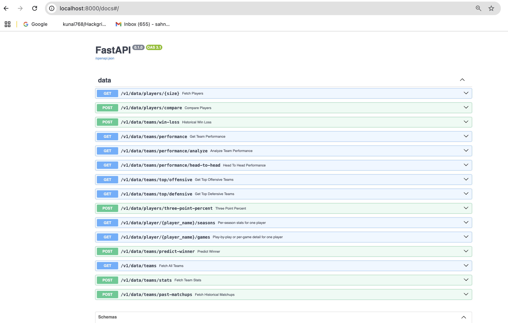

# 🏀 NCAA Basketball Stats API

A REST API service for advanced NCAA basketball analytics using BigQuery, featuring win prediction models and historical matchup analysis.

---

## 🚀 Quick Start

### 1. Clone the Repository
```bash
git clone https://github.com/kunal768/NCAA_Basketball_Stats.git
cd NCAA_Basketball_Stats
```


### 2. Prerequisites
- **Python 3.8+** (with pip)
- **BigQuery Account** ([Sign Up](https://cloud.google.com/bigquery))
- **Google Cloud SDK** (optional)

### 3. Install Dependencies
```bash
pip install -r requirements.txt
```


### 4. BigQuery Setup
1. Create Service Account and download JSON credentials
2. Place auth file in project root:
```bash
cp /path/to/your-credentials.json ./gcp_credentials.json
```


### 5. Environment Configuration
Create `.env` file with:
```env
PROJECT_ID=your-gcp-project-id
CRED_FILE_PATH=./gcp_credentials.json
TEAM_NAME_MAP=./notebooks/team_mappings.json
PREDICTION_MODEL=./notebooks/ncaa_model.pkl
```


### 6. Launch Development Server
```bash
uvicorn main:app --reload
```


### 7. Access API Documentation
🌐 Open in browser: [http://localhost:8000/docs](http://localhost:8000/docs)

---

## 🛠️ API Features


## Example API request 

```python3 
import requests

prediction = requests.post(
"http://localhost:8000/predict",
json={
"team1_name": "Duke",
"team2_name": "North Carolina",
}
)
print(prediction.json())
```


---

## 🔑 Key Files

| File                  | Purpose                          |
|-----------------------|---------------------------------|
| `gcp_credentials.json`| BigQuery authentication         |
| `team_mappings.json`  | Team name/ID mappings           |
| `ncaa_model.pkl`      | Trained prediction model        |
| `requirements.txt`    | Python dependencies             |

---

## 👥 Contributors

- **Kunal Keshav Singh Sahni** - Project Core Setup - (Server, BaseQuery, BaseRouter), Queries - Fetch All Teams Query, Fetch Player Names Query, Player Comparison Query, Historical Matchups Query, Team Stats Query, ML Win Prediction Model, Respective API endpoints for queries
- **Zach Kuo** – Historical Win-Loss Query, Three-Point Percent Query, Respective API endpoints for queries
- **Sonali Lonkar** – ADD
- **Lambert-Nguyen** – ADD

---

## 📚 Documentation

For advanced usage, see our [API Reference Guide](API_REFERENCE.md)

---

## 🆘 Support

Open an issue

---

> **Note**: All data comes from BigQuery's public NCAA dataset. Requires active internet connection for live queries.
